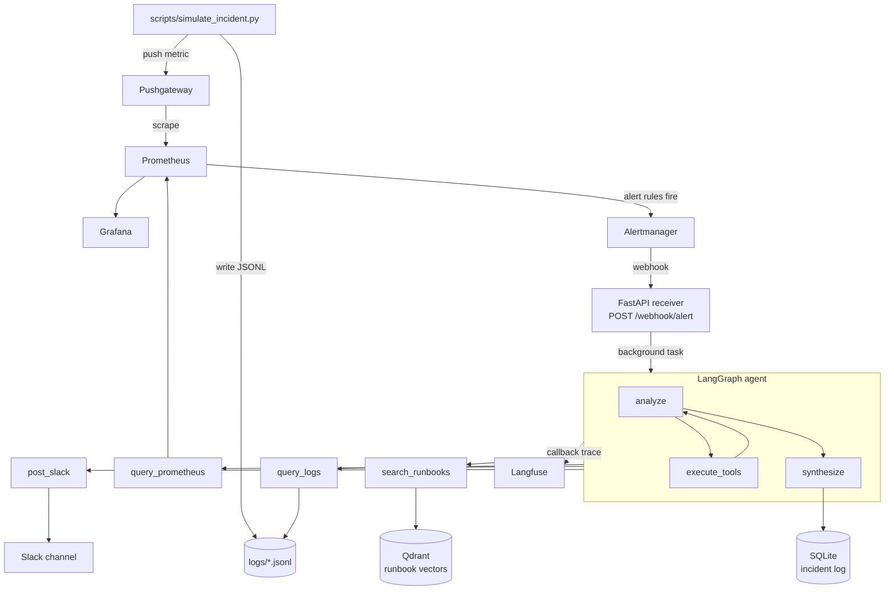

# IncidentPilot

An ML pipeline alert fires at 2am and the on-call engineer starts from nothing:
which metric moved, what the logs say, which of fifteen runbooks applies, and
whether this is the same failure as last week. IncidentPilot does that first
pass automatically, so the engineer opens Slack to a diagnosis with evidence
attached instead of a bare alert.

It is a LangGraph agent wired to a full local observability stack. A Docker
Compose simulation harness reproduces five ML pipeline failures end to end, so
the whole system is demonstrable on a laptop without touching live
infrastructure.


## What it does

Given an Alertmanager webhook, the agent runs an evidence-gathering loop over
four tools and then synthesizes a diagnosis:

- **Ingests Alertmanager webhooks.** `POST /webhook/alert` parses the payload,
  writes an incident record, and dispatches the agent as a background task,
  returning 202 immediately.
- **Queries live PromQL.** `query_prometheus` hits the Prometheus HTTP API to
  confirm the current value of the metric that fired, rather than trusting the
  value embedded in the alert annotation.
- **Searches service logs.** `query_logs` scans structured JSONL for a pattern
  within a time window, over an allowlist of four known services.
- **Retrieves the matching runbook.** 15 runbooks are chunked at 500 characters
  with 50 characters of overlap into **77 chunks**, embedded with
  `BAAI/bge-small-en-v1.5` into **384-dimensional vectors**, and stored in
  Qdrant under **cosine similarity**. `search_runbooks` embeds the failure
  description and returns the **top 2** chunks as RAG context.
- **Posts a structured diagnosis to Slack**, in a fixed format: root cause,
  evidence, recommended action, runbooks consulted.
- **Traces every tool call.** The graph is invoked with a Langfuse callback
  handler, so each LLM generation and tool invocation appears in order.
- **Persists an audit record.** Diagnosis, recommended action, runbooks used and
  the full tool-call log are written to SQLite and readable at
  `GET /incidents/{incident_id}`.

The loop is capped by `MAX_AGENT_ITERATIONS` and routed with LangGraph's
`tools_condition`, so the agent either gathers more evidence or moves to
synthesis.


## Quick start

The simulation harness is the point: it drives the entire pipeline, from metric
to fired alert to webhook to diagnosis, against synthetic failures. Nothing
here touches production infrastructure, and no paid cloud account is required
beyond free-tier API keys.

**Prerequisites.** Docker and Docker Compose. A Groq API key
(https://console.groq.com), a Slack bot token with `chat:write` invited to your
channel, and a Langfuse key pair. For the host-side scripts, **Python >= 3.10,
< 3.13**: `fastembed==0.2.7` declares `<3.13`, so resolution fails outright on
3.13. The Docker image is built on `python:3.11-slim` and is the supported path.

```bash
# 1. configure
cp .env.example .env && chmod 600 .env
# fill in GROQ_API_KEY, SLACK_BOT_TOKEN, SLACK_CHANNEL, the LANGFUSE_* keys and
# GRAFANA_ADMIN_PASSWORD. Compose refuses to start if the Grafana password is
# unset. Use https://us.cloud.langfuse.com if your Langfuse project is US-region.

# 2. bring up all six services
docker compose build && docker compose up -d

# 3. index the runbook corpus into Qdrant (idempotent, safe to re-run)
pip install fastembed qdrant-client python-dotenv
QDRANT_URL=http://localhost:6333 python scripts/index_runbooks.py
#    -> Indexed 15 files, 77 chunks, into runbooks.

# 4. fire a simulated incident and watch it resolve
python scripts/simulate_incident.py --scenario drift_detected
```

Step 4 writes synthetic log lines and pushes `model_psi_score=0.35` to
Pushgateway. Prometheus scrapes it, `ModelDriftDetected` fires, Alertmanager
calls the webhook, and the agent posts its diagnosis to Slack. Allow roughly a
minute for the alert rule's `for: 1m` window.

Scenarios: `serving_latency_spike`, `drift_detected`, `retraining_failure`,
`feature_staleness`, `high_error_rate`.

All six services publish on `127.0.0.1` only. None of them carry
authentication, so do not rebind them to `0.0.0.0` on an untrusted network.


## Security: a finding from auditing my own agent

Auditing this agent turned up a chain worth writing down, because it is a
failure mode that belongs to agents specifically rather than to web services in
general. Giving a model tools means the model's output becomes a caller, and
anything that reaches the model's context becomes potential instructions.

### The chain

Four individually reasonable decisions composed into something that was not.

1. `POST /webhook/alert` takes an Alertmanager payload with no authentication.
   That is deliberate for a local project, and it means alert labels are
   attacker-controlled input from any host that can reach the port.
2. Those labels were interpolated directly into the LLM system prompt. Nothing
   separated the operator's instructions from the alert's content, so text
   arriving in a label was read in the same voice as the instructions.
3. The model chooses the `service` argument for `query_logs`, which built a path
   as `f"{log_dir}/{service}.jsonl"` with no validation. A `service` of
   `../../etc/passwd` resolved outside `LOG_DIR`.
4. `post_slack` was already bound to the same model, so anything read had a way
   back out.

Each link is ordinary. The composition is an unauthenticated input reaching a
file read and an outbound channel, with an LLM as the pivot in between.

Two honest qualifications. The `.jsonl` suffix is always appended, so a
successful traversal could only ever read files ending in `.jsonl`, and the read
happens inside a container. This was a real chain, not a critical one.

### The fix, in three layers

**1. Allowlist the `service` argument, with a containment check behind it.**
`validate_service` in `src/agent/tools/validation.py` checks `service` against
an explicit set of four known services. Anything else is rejected before a path
is constructed. `resolve_within_directory` then resolves the final path and
asserts it stays inside `LOG_DIR`.

**2. Move webhook content out of the instruction channel.** Alert data is no
longer interpolated into the system prompt. It is rendered into a delimited
`<untrusted_alert_data>` block and sent as a separate message, and the system
prompt states that the block is data which must never be followed as
instructions. Because a label could otherwise contain a closing tag and escape
the block, `_neutralize_delimiters` defangs both tags in the content first.

**3. Validate every tool argument at the tool boundary.** Not just the one that
was exploitable. `promql`, `pattern`, `window_minutes`, `lookback_minutes`,
`query` and `message` are all bounds-checked where the tool receives them,
rather than trusting whatever the model produced.

### Why one layer would not have been enough

The obvious fix is to sanitise the path. Stripping `../` is the reflex, and it
is the weakest of the three options, because it defends against one spelling of
the attack rather than the capability behind it.

Running each layer independently against the eight traversal payloads in the
test suite shows the difference. The containment check alone rejects the plain
`../../etc/passwd` forms, but `..%2f..%2fetc%2fpasswd`, `....//....//etc/passwd`
and `~/.ssh/id_rsa` all resolve to paths that stay inside `LOG_DIR` and slip
past it, and an embedded null byte raises a raw `ValueError` from `realpath`
rather than a clean rejection. The allowlist rejects all eight by construction,
because it never asks what a string looks like, only whether it is one of four
known values.

The layers also cover different questions, which is the real argument for having
all three:

- The allowlist answers *can this argument name anything harmful*.
- The prompt structure answers *should the model have been induced to make this
  call at all*, which no amount of path validation addresses.
- The boundary validation answers *what happens when the next tool is added*,
  since the pattern is now in place rather than being remembered.

Layer 2 is the one that generalises. Layer 1 closes this path; layer 2 reduces
the odds that the model is steered into hostile tool calls at all, which matters
for tools that do not touch the filesystem.

### Verification

31 tests in `tests/`. `test_tool_input_validation.py` asserts rejection of eight
traversal payloads covering relative, absolute, URL-encoded, doubled-prefix,
null-byte and home-directory forms. `test_prompt_isolation.py` asserts that
injected delimiters are defanged, that the data block stays balanced under
hostile labels, and that no alert placeholder remains in the system prompt.

```
pip install -r requirements-dev.txt
pytest
```

Since none of the six services carry authentication, all of them publish on
`127.0.0.1` only.


## Limitations

Stated plainly, because they bound what this project demonstrates.

- **The runbook corpus is ML-ops specific.** All 15 runbooks cover model
  serving, drift, feature stores, and training failures. Retrieval quality
  depends entirely on a relevant runbook existing, so applying this to another
  domain means writing a new corpus, not just repointing the agent.
- **The model emits malformed tool calls.** `llama-3.1-8b-instant` was chosen
  for fast, free-tier inference, and it intermittently produces tool-call
  syntax that the Groq API rejects with a 400. This is handled by graceful
  degradation, not eliminated: `analyze_node` catches `BadRequestError` and
  falls back to a diagnosis that reports the failure rather than crashing the
  run. Diagnosis quality varies between runs as a result, and a larger model
  would reduce but not remove this.
- **It has only ever run against simulated alerts.** Every scenario is
  synthetic, pushed through Pushgateway with hand-written log fixtures. The
  agent has never been pointed at live infrastructure, so nothing here is
  evidence about behaviour under real alert volume, noisy labels, or genuinely
  ambiguous failures.
- **No authentication anywhere.** Deliberate for a local project and mitigated
  by loopback binding, but it is the reason the security work in the previous
  section was necessary.
- **Single alert per webhook.** Only `payload.alerts[0]` is processed; grouped
  alerts beyond the first are ignored.
- **Tracing failures are silent.** The Langfuse callback swallows upload errors
  so the agent keeps working, which means a misconfigured tracing setup looks
  identical to a healthy one from the outside. This is not hypothetical: the
  first two runs on 9 July completed normally and wrote their incident rows,
  but uploaded nothing, because `LANGFUSE_HOST` pointed at the EU host while
  the project was US-region. The only symptom was a 401 in the container logs.
  If traces matter to you, check that they are actually arriving rather than
  assuming, and see the region note in the quick start.
- **`qdrant-client` is pinned to 1.9.1 and the call site depends on it.**
  `search_runbooks` calls `client.search(...)`, which was removed in later
  releases in favour of `client.query_points(...)`. Unpinning to 1.18.0 without
  updating `src/agent/tools/runbook_tool.py` fails immediately with
  `AttributeError: 'QdrantClient' object has no attribute 'search'`. The Docker
  image builds against 1.9.1, so this only bites when installing the host-side
  dependencies into an environment that already has a newer client.


## Architecture



Alert content arriving from the webhook is treated as untrusted input. See the
security section above for the threat model and the controls around it.


## What to observe

- **Slack**: the configured channel receives a formatted diagnosis message
  (root cause, evidence, recommended action, runbooks consulted).
- **Langfuse**: a trace of the agent run, showing each LLM call and tool
  invocation in sequence, is visible in your Langfuse project dashboard.
- **SQLite**: query the incident record via the API:
  ```
  curl http://localhost:8000/incidents/<incident_id>
  ```
  or inspect `data/incidents.db` directly with the `sqlite3` CLI.


## Incident scenarios

| Scenario                | Alert fired          | What the agent diagnoses |
|--------------------------|-----------------------|---------------------------|
| `serving_latency_spike`  | ServingLatencyHigh     | P99 latency spike correlated with GPU memory pressure and growing request queue depth; recommends reducing batch size or rolling back the model version. |
| `drift_detected`         | ModelDriftDetected      | PSI score breach on a feature set, tied to an upstream schema change; recommends retraining on the current data distribution. |
| `retraining_failure`     | RetrainingJobFailed     | Training job killed by an OOM condition on the GPU node; recommends resuming from the last valid checkpoint with a reduced memory footprint. |
| `feature_staleness`      | FeatureStalenessHigh    | Feature view has not been materialized recently, traced to Kafka consumer lag blocking the online store refresh; recommends a manual materialization. |
| `high_error_rate`        | ServingErrorRateHigh    | Elevated serving error rate traced to an input schema mismatch between the feature pipeline and the model server; recommends aligning the input contract or rolling back. |


## Stack

| Component               | Role                                              | Why chosen |
|--------------------------|----------------------------------------------------|------------|
| FastAPI                 | Webhook receiver and incident API                  | Lightweight, async-native, minimal boilerplate for a small HTTP surface. |
| LangGraph                | Agent orchestration (analyze/tools/synthesize loop) | Explicit state graph gives deterministic control over tool-calling iteration and routing. |
| Groq (llama-3.1-8b-instant) | LLM for diagnosis synthesis                     | Fast, free-tier-friendly inference suitable for a personal project with no paid cloud dependency. |
| Qdrant + fastembed        | Runbook semantic search                            | Local vector store with no external embedding API required; runs fully in Docker. |
| Prometheus + Alertmanager + Pushgateway | Metrics, alerting, and synthetic incident triggering | Standard, well-documented alerting stack; Pushgateway lets a script simulate failures without a real exporter. |
| Grafana                  | Metrics visualization                              | Pairs directly with the existing Prometheus datasource for ad hoc inspection. |
| SQLite                   | Incident log persistence                           | Zero-configuration embedded database, sufficient for a single-instance personal project. |
| Langfuse                  | LLM observability and tracing                       | Free-tier cloud tracing for inspecting the agent's tool-call sequence per incident. |
| Slack                    | Diagnosis delivery                                  | Familiar incident-response notification channel with a simple bot API. |
