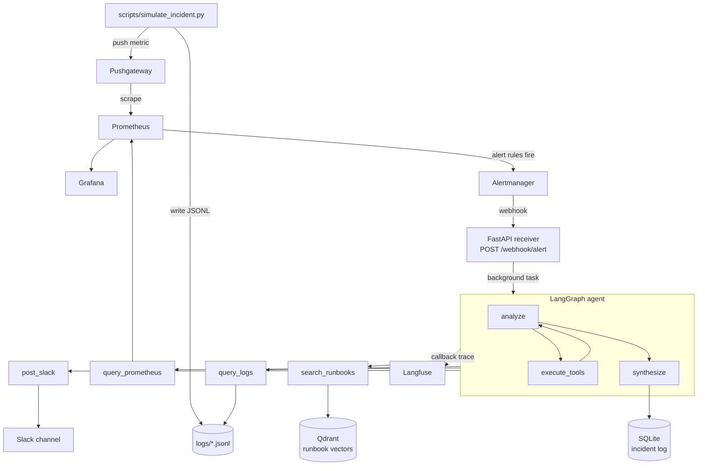

# IncidentPilot

IncidentPilot is an ML-pipeline-specific incident response agent. When a Prometheus
alert fires for drift, latency, retraining failure, feature staleness, or a high
serving error rate, a LangGraph agent gathers evidence from Prometheus, service logs,
and a runbook corpus, then posts a root cause diagnosis to Slack and logs the incident
to SQLite.


## Architecture



Alert content arriving from the webhook is treated as untrusted input. See
[SECURITY.md](SECURITY.md) for the threat model and the controls around it.


## Prerequisites

- **Python >= 3.10, < 3.13** for the host-side scripts. `fastembed==0.2.7`
  declares `<3.13`, so dependency resolution fails outright on Python 3.13.
  The Docker image is built on `python:3.11-slim` and is the supported path.
- Docker and Docker Compose
- A Groq API key (https://console.groq.com)
- A Slack bot token with `chat:write` scope, invited to the target channel
- A Langfuse account (cloud or self-hosted) with a public/secret key pair


## Setup

1. Clone the repository and `cd` into it.
2. Copy `.env.example` to `.env` and fill in `GROQ_API_KEY`, `SLACK_BOT_TOKEN`,
   `SLACK_CHANNEL`, `LANGFUSE_PUBLIC_KEY`, `LANGFUSE_SECRET_KEY`, `LANGFUSE_HOST`
   (use `https://us.cloud.langfuse.com` if your Langfuse project is on the US region),
   and `GRAFANA_ADMIN_PASSWORD`. Compose refuses to start if the Grafana password
   is unset. Restrict the file with `chmod 600 .env`.

   All six services publish on `127.0.0.1` only. None of them carry
   authentication, so do not change these bindings to `0.0.0.0` on a shared or
   untrusted network.
3. Build and start the stack:
   ```
   docker compose build
   docker compose up -d
   ```
4. Index the runbook corpus into Qdrant (run from the host, against `localhost`):
   ```
   pip install fastembed qdrant-client python-dotenv
   QDRANT_URL=http://localhost:6333 python scripts/index_runbooks.py
   ```


## Security: a finding from auditing my own agent

Auditing this agent turned up a chain worth writing down, because it is a
failure mode that belongs to agents specifically rather than to web services in
general. Giving a model tools means the model's output becomes a caller, and
anything that reaches the model's context becomes potential instructions.

### The chain

Four individually reasonable decisions composed into something that was not.

1. `POST /webhook/alert` takes an Alertmanager payload with no authentication.
   That is deliberate for a local project, and it means alert labels are
   attacker-controlled input from any host that can reach the port.
2. Those labels were interpolated directly into the LLM system prompt. Nothing
   separated the operator's instructions from the alert's content, so text
   arriving in a label was read in the same voice as the instructions.
3. The model chooses the `service` argument for `query_logs`, which built a path
   as `f"{log_dir}/{service}.jsonl"` with no validation. A `service` of
   `../../etc/passwd` resolved outside `LOG_DIR`.
4. `post_slack` was already bound to the same model, so anything read had a way
   back out.

Each link is ordinary. The composition is an unauthenticated input reaching a
file read and an outbound channel, with an LLM as the pivot in between.

Two honest qualifications. The `.jsonl` suffix is always appended, so a
successful traversal could only ever read files ending in `.jsonl`, and the read
happens inside a container. This was a real chain, not a critical one.

### The fix, in three layers

**1. Allowlist the `service` argument, with a containment check behind it.**
`validate_service` in `src/agent/tools/validation.py` checks `service` against
an explicit set of four known services. Anything else is rejected before a path
is constructed. `resolve_within_directory` then resolves the final path and
asserts it stays inside `LOG_DIR`.

**2. Move webhook content out of the instruction channel.** Alert data is no
longer interpolated into the system prompt. It is rendered into a delimited
`<untrusted_alert_data>` block and sent as a separate message, and the system
prompt states that the block is data which must never be followed as
instructions. Because a label could otherwise contain a closing tag and escape
the block, `_neutralize_delimiters` defangs both tags in the content first.

**3. Validate every tool argument at the tool boundary.** Not just the one that
was exploitable. `promql`, `pattern`, `window_minutes`, `lookback_minutes`,
`query` and `message` are all bounds-checked where the tool receives them,
rather than trusting whatever the model produced.

### Why one layer would not have been enough

The obvious fix is to sanitise the path. Stripping `../` is the reflex, and it
is the weakest of the three options, because it defends against one spelling of
the attack rather than the capability behind it.

Running each layer independently against the eight traversal payloads in the
test suite shows the difference. The containment check alone rejects the plain
`../../etc/passwd` forms, but `..%2f..%2fetc%2fpasswd`, `....//....//etc/passwd`
and `~/.ssh/id_rsa` all resolve to paths that stay inside `LOG_DIR` and slip
past it, and an embedded null byte raises a raw `ValueError` from `realpath`
rather than a clean rejection. The allowlist rejects all eight by construction,
because it never asks what a string looks like, only whether it is one of four
known values.

The layers also cover different questions, which is the real argument for having
all three:

- The allowlist answers *can this argument name anything harmful*.
- The prompt structure answers *should the model have been induced to make this
  call at all*, which no amount of path validation addresses.
- The boundary validation answers *what happens when the next tool is added*,
  since the pattern is now in place rather than being remembered.

Layer 2 is the one that generalises. Layer 1 closes this path; layer 2 reduces
the odds that the model is steered into hostile tool calls at all, which matters
for tools that do not touch the filesystem.

### Verification

31 tests in `tests/`. `test_tool_input_validation.py` asserts rejection of eight
traversal payloads covering relative, absolute, URL-encoded, doubled-prefix,
null-byte and home-directory forms. `test_prompt_isolation.py` asserts that
injected delimiters are defanged, that the data block stays balanced under
hostile labels, and that no alert placeholder remains in the system prompt.

```
pip install -r requirements-dev.txt
pytest
```

Since none of the six services carry authentication, all of them publish on
`127.0.0.1` only. [SECURITY.md](SECURITY.md) covers the threat model and the
per-CVE reachability analysis for the pinned dependencies.


## Running a simulation

```
python scripts/simulate_incident.py --scenario drift_detected
```

This writes synthetic log lines and pushes a metric to Pushgateway. Prometheus
evaluates its alert rules on a 30 second interval; once the alert fires, Alertmanager
sends a webhook to IncidentPilot, which runs the agent in the background.

Available scenarios: `serving_latency_spike`, `drift_detected`, `retraining_failure`,
`feature_staleness`, `high_error_rate`.


## What to observe

- **Slack**: the configured channel receives a formatted diagnosis message
  (root cause, evidence, recommended action, runbooks consulted).
- **Langfuse**: a trace of the agent run, showing each LLM call and tool
  invocation in sequence, is visible in your Langfuse project dashboard.
- **SQLite**: query the incident record via the API:
  ```
  curl http://localhost:8000/incidents/<incident_id>
  ```
  or inspect `data/incidents.db` directly with the `sqlite3` CLI.


## Incident scenarios

| Scenario                | Alert fired          | What the agent diagnoses |
|--------------------------|-----------------------|---------------------------|
| `serving_latency_spike`  | ServingLatencyHigh     | P99 latency spike correlated with GPU memory pressure and growing request queue depth; recommends reducing batch size or rolling back the model version. |
| `drift_detected`         | ModelDriftDetected      | PSI score breach on a feature set, tied to an upstream schema change; recommends retraining on the current data distribution. |
| `retraining_failure`     | RetrainingJobFailed     | Training job killed by an OOM condition on the GPU node; recommends resuming from the last valid checkpoint with a reduced memory footprint. |
| `feature_staleness`      | FeatureStalenessHigh    | Feature view has not been materialized recently, traced to Kafka consumer lag blocking the online store refresh; recommends a manual materialization. |
| `high_error_rate`        | ServingErrorRateHigh    | Elevated serving error rate traced to an input schema mismatch between the feature pipeline and the model server; recommends aligning the input contract or rolling back. |


## Stack

| Component               | Role                                              | Why chosen |
|--------------------------|----------------------------------------------------|------------|
| FastAPI                 | Webhook receiver and incident API                  | Lightweight, async-native, minimal boilerplate for a small HTTP surface. |
| LangGraph                | Agent orchestration (analyze/tools/synthesize loop) | Explicit state graph gives deterministic control over tool-calling iteration and routing. |
| Groq (llama-3.1-8b-instant) | LLM for diagnosis synthesis                     | Fast, free-tier-friendly inference suitable for a personal project with no paid cloud dependency. |
| Qdrant + fastembed        | Runbook semantic search                            | Local vector store with no external embedding API required; runs fully in Docker. |
| Prometheus + Alertmanager + Pushgateway | Metrics, alerting, and synthetic incident triggering | Standard, well-documented alerting stack; Pushgateway lets a script simulate failures without a real exporter. |
| Grafana                  | Metrics visualization                              | Pairs directly with the existing Prometheus datasource for ad hoc inspection. |
| SQLite                   | Incident log persistence                           | Zero-configuration embedded database, sufficient for a single-instance personal project. |
| Langfuse                  | LLM observability and tracing                       | Free-tier cloud tracing for inspecting the agent's tool-call sequence per incident. |
| Slack                    | Diagnosis delivery                                  | Familiar incident-response notification channel with a simple bot API. |
